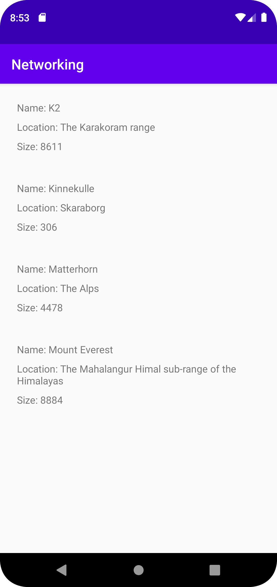

# Rapport
First off forked the network project and added item_lists with 3 TextViews.
Designed the item_lists and started to add recyclerView into the project.
The recyclerView did not display any data yet.
Then I added data into the recyclerView from the json file in the project. and structured what the recyclerView should show.
The recyclerView now works with data from the Json file.
The final commit I added uses-permission for internet, then fetched the data to see the structure of the Json.
Then i did a Mountain class of all the data is needed with getters and now have a Mountain object. I also fixed the recyclerView and it can now display the mountains with the corresponding location.
gson creates an object from the json and inserts the data to the right variables in Mountain constructor.


```Java
public void onPostExecute(String json) {
           Gson gson = new Gson();

           Type type = new TypeToken<ArrayList<Mountain>>() {}.getType();
           ArrayList<Mountain> fetchedMountainList = gson.fromJson(json, type);
           mountainList.addAll(fetchedMountainList);
           mountainAdapter.notifyDataSetChanged();
           Log.d("MainActivity", json);
       }
```


